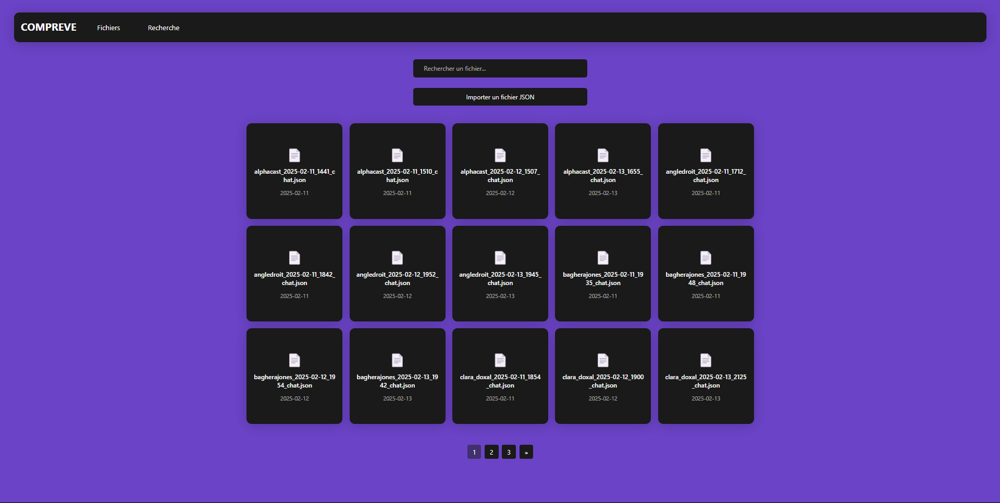
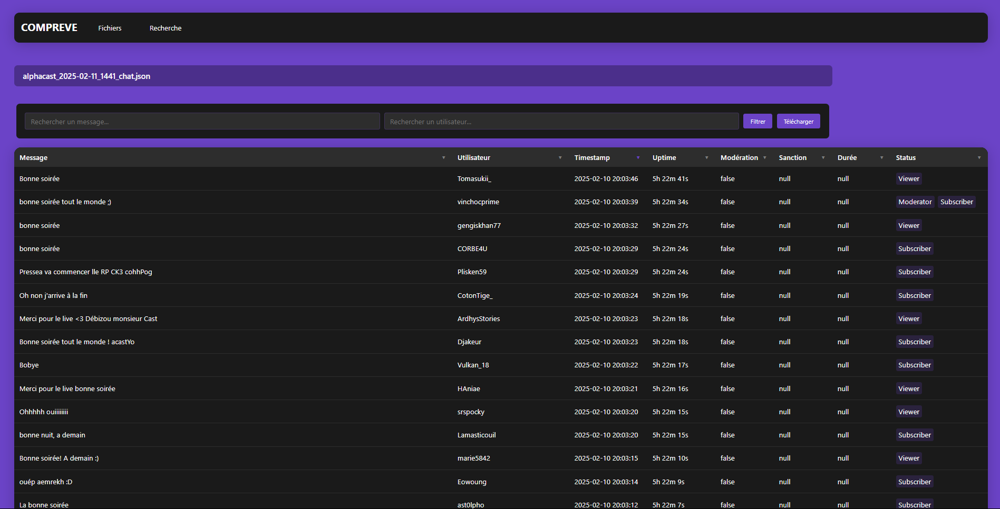
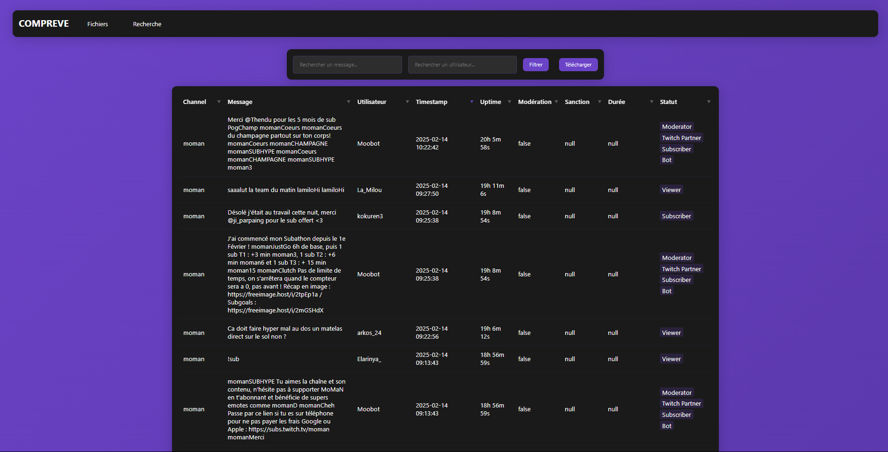

# COMPREVE - Twitch Chat Analysis Platform

[English](#english) | [Français](#français)

## English

### Overview
COMPREVE is a Django-based web application designed for analyzing Twitch chat messages. It provides tools for uploading, searching, filtering, and analyzing chat data.

### Screenshots

#### Login Page

*User authentication interface*

#### Files Management

*Manage JSON files (search, upload, delete)*

#### Database Overview

*Analyse (search, filter, sort, download) the choosen chat file*

#### Search and Analysis

*Analyse (search, filter, sort, download) chat messages across all channels*

### Features

#### 1. File Management
- Upload JSON files
- View and manage uploaded files
- Support for multiple file uploads
- Data validation and processing

#### 2. Search and Analysis
- Advanced search functionality for messages and users
- Multi-channel filtering
- Sort messages by various criteria:
  - Timestamp
  - Username
  - Message content
  - Moderation status
- Pagination

#### 3. Filtering Options
- Filter by moderation status
- Filter by message status
- Channel-specific filtering
- Combined filters for precise results

#### 4. Data Export
- Export filtered results in multiple formats:
  - JSON
  - CSV
  - XML
- Preserve all applied filters in exports
- Download complete or filtered datasets
- Display of filters and sort before and after export

#### 5. User Interface
- Clean and intuitive design
- Responsive layout
- Easy-to-use filter controls
- Clear data presentation
- One-click copy functionality for messages and usernames

### Installation

1. Clone the repository:
```bash
git clone <repository-url>
cd compreve
```

2. Create a virtual environment and activate it:
```bash
python -m venv venv
source venv/bin/activate  # On Unix/macOS
venv\Scripts\activate     # On Windows
```

3. Create database migrations:
```bash
python manage.py makemigrations
```

4. Apply migrations to create the database:
```bash
python manage.py migrate
```

5. Start the server:
```bash
python manage.py runserver
```

6. Access the application at `http://localhost:8000`

---

## Français

### Aperçu
COMPREVE est une application web basée sur Django conçue pour analyser les chats Twitch. Elle fournit des outils pour télécharger, rechercher, filtrer et analyser les données.

### Captures d'écran

#### Page de connexion

*Interface d'authentification utilisateur*

#### Gestion des fichiers

*Gestion des fichiers JSON (rechercher, télécharger, visualiser, supprimer)*

#### Aperçu de la base de données

*Analyser (rechercher, filtrer, trier, télécharger) le fichier sélectionné*

#### Recherche et analyse

*Analyser (rechercher, filtrer, trier, télécharger) les messages de chat de tous les fichiers*

### Fonctionnalités

#### 1. Gestion des fichiers
- Téléchargement de fichiers JSON contenant des données de chat
- Visualisation et gestion des fichiers téléchargés
- Support pour les téléchargements multiples
- Validation et traitement des données

#### 2. Recherche et analyse
- Fonctionnalité de recherche avancée pour les messages et les utilisateurs
- Filtrage multi-chaînes
- Tri des messages selon différents critères :
  - Horodatage
  - Nom d'utilisateur
  - Contenu du message
  - Statut de modération
- Pagination 

#### 3. Options de filtrage
- Filtrage par statut de modération
- Filtrage par statut de message
- Filtrage par chaîne spécifique
- Filtres combinés 

#### 4. Export de données
- Export des résultats filtrés dans plusieurs formats :
  - JSON
  - CSV
  - XML
- Conservation de tous les filtres appliqués dans les exports
- Téléchargement des ensembles de données complets ou filtrés
- Affichage des filtres et du tri avant et après l'exportation

#### 5. Interface utilisateur
- Design épuré et intuitif
- Mise en page responsive
- Contrôles de filtrage faciles à utiliser
- Présentation claire des données
- Copie rapide des messages et noms d'utilisateur en un clic

### Installation

1. Cloner le dépôt :
```bash
git clone <url-du-depot>
cd compreve
```

2. Créer un environnement virtuel et l'activer :
```bash
python -m venv venv
source venv/bin/activate  # Sur Unix/macOS
venv\Scripts\activate     # Sur Windows
```

3. Créer les migrations de la base de données :
```bash
python manage.py makemigrations
```

4. Appliquer les migrations pour créer la base de données :
```bash
python manage.py migrate
```

5. Démarrer le serveur :
```bash
python manage.py runserver
```

6. Accéder à l'application sur `http://localhost:8000`
